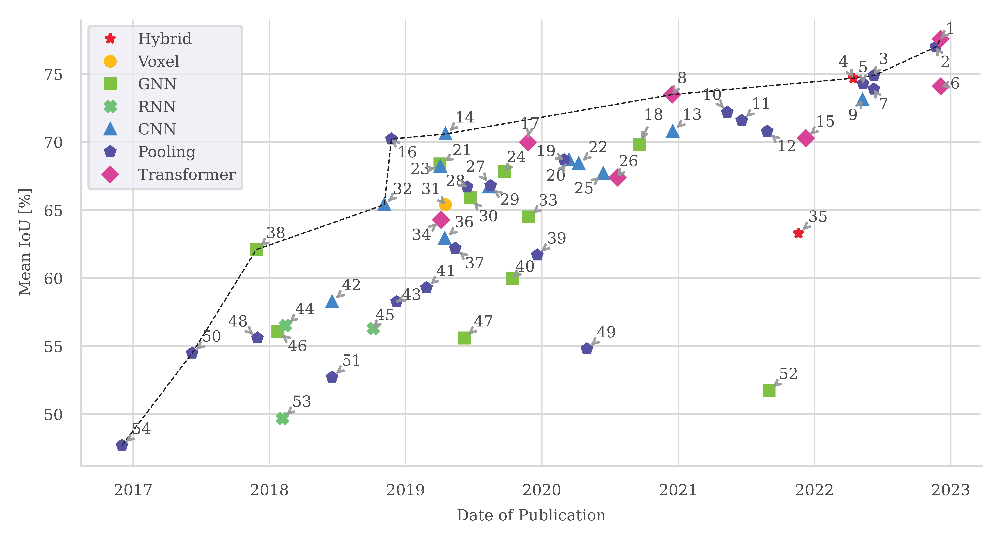

# Article - _[Semantic point cloud segmentation with deep learning-based approaches for the construction industry: A Survey](https://doi.org/10.3390/app13169146)_


<p style="text-align: center;">Figure 13: Reported results for semantic segmentation task on the large-scale indoor  <a href="http://buildingparser.stanford.edu/dataset.html">S3DIS</a> benchmark.</p>



> Authors: ***Lukas Rauch***, _Thomas Braml_   
> Correspondence: _lukas.rauch@unibw.de_   
> DOI: _[https://doi.org/10.3390/app13169146](https://doi.org/10.3390/app13169146)_

## Abstract

Point cloud learning has recently gained strong attention due to its applications in various fields, like computer vision, robotics, and autonomous driving. Point cloud semantic segmentation (PCSS) enables the automatic extraction of semantic information from 3D point cloud data, which makes it a desirable task for construction-related applications as well. Yet, only a limited number of publications have applied deep-learning-based methods to address point cloud understanding for civil engineering problems, and there is still a lack of comprehensive reviews and evaluations of PCSS methods tailored to such use cases. This paper aims to address this gap by providing a survey of recent advances in deep-learning-based PCSS methods and relating them to the challenges of the construction industry. We introduce its significance for the industry and provide a comprehensive look-up table of publicly available datasets for point cloud understanding, with evaluations based on data scene type, sensors, and point features. We address the problem of class imbalance in 3D data for machine learning, provide a compendium of commonly used evaluation metrics for PCSS, and summarize the most significant deep learning methods developed for PCSS. Finally, we discuss the advantages and disadvantages of the methods for specific industry challenges. Our contribution, to the best of our knowledge, is the first survey paper that comprehensively covers deep-learning-based methods for semantic segmentation tasks tailored to construction applications. This paper serves as a useful reference for prospective research and practitioners seeking to develop more accurate and efficient PCSS methods.

<!-- ---  -->
> Keywords: point cloud; semantic segmentation; deep learning; machine learning; construction; automation; open source; dataset; survey

## Bibtext
```Bibtex
@article{rauch:2023,
  title={Semantic Point Cloud Segmentation with Deep-Learning-Based Approaches for the Construction Industry: A Survey},
  author={Rauch Lukas, Braml Thomas},
  journal={Applied Science},
  year={2023},
  publisher={MDPI}
}
```

| First Header  | Second Header |
| ------------- | ------------- |
| Content Cell  | Content Cell  |
| Content Cell  | Content Cell  |


## Supplementary Material

### List of  publicly available dataset for 3D-scene understanding (Preview)

TABLE I. List of publicly available datasets for 3D-scene understanding, categories by data acquisition method, the content of the dataset, used hardware, data representation, and extent of available annotation classes. Declaration of data type real-world (R), synthetic (S).


|Nr. |Year|Name |Resource|Data type|Objects|Indoor sites|Urban (S)|Urban (D)|Industrial|Infrastructure / Rural|Panoramic cameras|Stereo camera|RGB-D|TLS|MLS|ALS|Aerial photogrammetry|IMU|GPS|RGB sequence|Depth sequence|Point cloud|3D model|RGB|Intensity|Mesh|Normals|# Sem. classes|Object detection|Pose estimation|Shape classfication|Object tracking|Semantic segmentation|Instance sem. segmentation|PC registration|Scene reconstruction|Surface reconstruction|Volume reconstruction|SLAM|# Points|# Frames|# Scenes|# Scans|
|------|----|-------------------------------------|-----------------------------------------------------------------------------------------------------------------------------------------------------------------------------------------------------------------------|---------|-------|------------|---------|---------|----------|----------------------|-----------------|-------------|-----|---|---|---|---------------------|---|---|------------|--------------|-----------|--------|---|---------|----|-------|--------------|----------------|---------------|-------------------|---------------|---------------------|--------------------------|---------------|--------------------|----------------------|---------------------|----|--------|--------|--------|-------|
|1     |2009|Oakland 3-D                          |[link](https://www.ri.cmu.edu/pub_files/2009/6/munoz_cvpr_09.pdf)                                                                                                                                                              |R        |       |            |1        |         |          |                      |                 |             |     |1  |   |   |                     |   |   |            |              |1          |        |   |         |    |       |5             |                |               |                   |               |1                    |                          |               |                    |                      |                     |    |1,6M    |        |        |       |
|2     |2011|Ford Campus Vision and Lidar Data Set|[link](http://robots.engin.umich.edu/uploads/SoftwareData/Ford/ijrr2011.pdf)                                                                                                                                                   |R        |       |            |         |1        |          |                      |1                |             |     |   |1  |   |                     |1  |1  |1           |              |1          |        |1  |1        |    |       |              |1               |               |                   |               |1                    |                          |               |                    |                      |                     |1   |        |        |2       |       |
|3     |2012|KITTI stereo evaluation 2012         |[link](https://www.cvlibs.net/publications/Geiger2012CVPR.pdf)                                                                                                                                                                 |R        |       |            |         |1        |          |                      |                 |1            |     |   |1  |   |                     |1  |1  |1           |1             |           |        |1  |         |    |       |8             |1               |1              |                   |1              |1                    |1                         |               |                    |                      |                     |1   |        |1,5K    |22      |       |
|4     |2013|NYUv2                                |[link](https://arxiv.org/pdf/1301.3572.pdf)                                                                                                                                                                                    |R        |       |1           |         |         |          |                      |                 |             |1    |   |   |   |                     |   |   |1           |1             |           |        |   |         |    |       |14            |                |               |                   |               |1                    |                          |               |                    |                      |                     |    |        |407,0K  |464     |       |
|5     |2013|SUN3D                                |[link](https://vision.princeton.edu/projects/2013/SUN3D/paper.pdf)                                                                                                                                                             |R        |       |1           |         |         |          |                      |                 |             |1    |   |   |   |                     |   |   |1           |1             |           |        |   |         |    |       |              |                |               |                   |               |1                    |1                         |               |1                   |                      |                     |    |        |        |254     |415    |
|6     |2013|Sydney Urban Objects                 |[link](https://www.araa.asn.au/acra/acra2013/papers/pap133s1-file1.pdf)                                                                                                                                                        |R        |1      |            |         |         |          |                      |                 |             |     |   |1  |   |                     |   |   |            |              |1          |        |   |         |    |       |14            |                |               |1                  |               |                     |                          |               |                    |                      |                     |    |        |        |        |613    |
|7     |2014|Paris-rue-Madame database            |[link](https://hal.archives-ouvertes.fr/hal-00963812/document)                                                                                                                                                                 |R        |       |            |         |1        |          |                      |                 |             |     |   |1  |   |                     |   |   |            |              |1          |        |   |1        |    |       |17            |                |               |                   |               |1                    |1                         |               |                    |                      |                     |    |2,0M    |        |1       |2      |


### 2. Rankings on S3DIS Semantic Segmentation Benchmark (Previrew)
Reported results for semantic segmentation task on the large-scale indoor S3DIS benchmark (including all 6 areas, 6-fold cross validation). 
Ranked in descending order based on mIoU performance. 
> Declaration: C---convolution-based, G---graph-based,  H---hybrid, P---pooling-based, R---RNN-based, T---Transformer-based, V---voxel-based.

| Rank | Year | Model Name | Link | Method | mIoU | mAcc  | oAcc  |
|------|------|------------|------|--------|------|-------|-------|
| 1    | 2022       | WindowNorm+StratifiedTransformer | [link](https://arxiv.org/pdf/2212.02287v1.pdf)         | T    | 77.60 | 85.8  |
| 2    | 2022       | PointMetaBase-XXL                | [link](https://arxiv.org/pdf/2211.14462v1.pdf)         | MLP  | 77.00 | -     |
| 3    | 2022       | PointNeXt-XL                     | [link](https://arxiv.org/pdf/2206.04670v2.pdf)         | MLP  | 74.90 | 83.0  |
| 4    | 2022       | DeepViewAgg                      | [link](https://arxiv.org/pdf/2204.07548v2.pdf)         | H    | 74.70 | 83.8  |
| 5    | 2022       | RepSurf-U                        | [link](https://arxiv.org/pdf/2205.05740v2.pdf)         | MLP  | 74.30 | 82.6  |
| 6    | 2022       | WindowNorm+PointTransformer      | [link](https://arxiv.org/pdf/2212.02287v1.pdf)         | T    | 74.10 | 82.5  |
| 7    | 2022       | PointNeXt-L                      | [link](https://arxiv.org/pdf/2206.04670v2.pdf)         | MLP  | 73.90 | 82.2  |
| 8    | 2020       | PointTransformer                 | [link](https://arxiv.org/pdf/2012.09164v2.pdf)         | T    | 73.50 | 81.9  |


